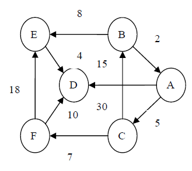
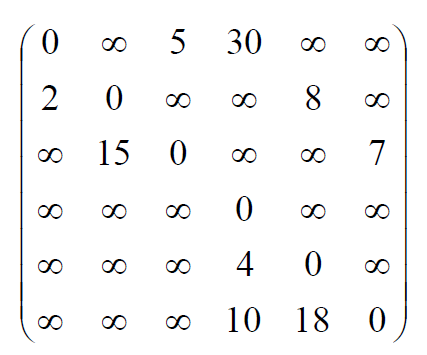
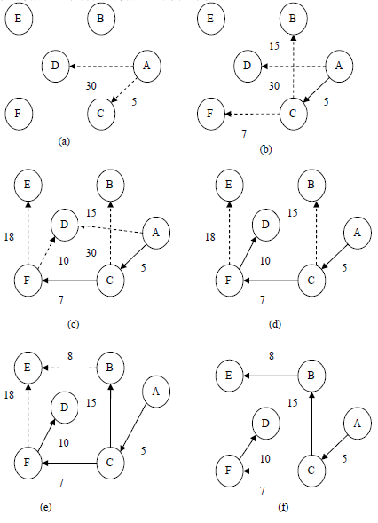
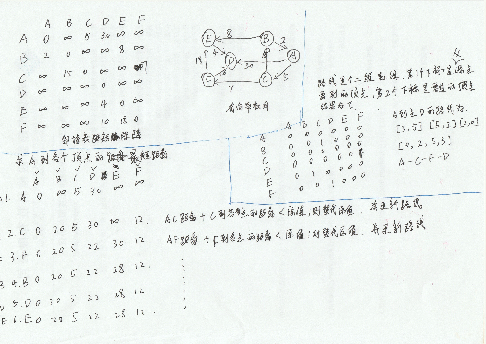
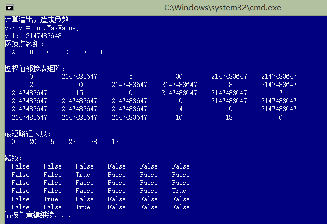

# 最短路径

## 最短路径的概念

最短路径问题是图的又一个比较典型的应用问题。例如，n个城市之间的一个公路网，给定这些城市之间的公路的距离，能否找到城市A到城市B之间一条距离最近的通路呢？如果城市用顶点表示，城市间的公路用边表示，公路的长度作为边的权值。那么，这个问题就可归结为在网中求顶点A到顶点B的所有路径中边的权值之和最小的那一条路径，这条路径就是两个顶点之间的最短路径(Shortest Path)，并称路径上的第一个顶点为源点（Source），最后一个顶点为终点（Destination）。在不带权的图中，最短路径是指两个顶点之间经历的边数最少的路径。

最短路径可以是求某个源点出发到其它顶点的最短路径，也可以是求网中任意两个顶点之间的最短路径。这里只讨论单源点的最短路径问题。

如有如下有向带权网，有顶点集合```[A,B,C,D,E,F]```



得出如下邻接矩阵



表格形式

顶点|A|B|C|D|E|F
:--:|:--:|:--:|:--:|:--:|:--:|:--:
A|0|∞|5|30|∞|∞
B|2|0|∞|∞|8|∞
C|∞|15|0|∞|∞|∞
D|∞|∞|∞|0|∞|∞
E|∞|∞|∞|4|0|∞
F|∞|∞|∞|10|18|0

计作集合

```C#
[
[ 0, ∞, 5,30, ∞, ∞],
[ 2, 0, ∞, ∞, 8, ∞],
[ ∞,15, 0, ∞, ∞, 7],
[ ∞, ∞, ∞, 0, ∞, ∞],
[ ∞, ∞, ∞, 4, 0, ∞],
[ ∞, ∞, ∞,10,18, 0]
]
```

如上，该网从顶点A到顶点D有4条路径，分别是：路径（A,D），其带权路径长度为30；路径（A,C,F,D），其带权路径长度为22；路径（A,C,B,E,D），其带权路径长度为32；路径（A,C,F,E,D），其带权路径长度为34。路径（A,C,F,D）称为最短路径，其带权路径长度22称为最短距离。

## 狄克斯特拉（Dikastra）算法

对于求单源点的最短路径问题，狄克斯特拉（Dikastra）提出了一个按路径长度递增的顺序逐步产生最短路径的构造算法。狄克斯特拉的算法思想是：设置两个顶点的集合S和T，集合S中存放已找到最短路径的顶点，集合T中存放当前还未找到最短路径的顶点。初始状态时，集合S中只包含源点，设为v0，然后从集合T中选择到源点v0路径长度最短的顶点u加入到集合S中，集合S中每加入一个新的顶点u都要修改源点v0到集合T中剩余顶点的当前最短路径长度值，集合T中各顶点的新的最短路径长度值为原来的当前最短路径长度值与从源点过顶点u到达该顶点的新的最短路径长度中的较小者。此过程不断重复，直到集合T中的顶点全部加到集合S中为止。

### 实现步骤

1. 列出顶点A到其余各顶点的路径长度，它们分别为0、∞、5、30、∞、∞。从中选取路径长度最小的顶点C（从源点到顶点C的最短路径为5）。
2. 找到顶点C后，再观察从源点经顶点C到各个顶点的路径是否比第一步所找到的路径要小（已选取的顶点则不必考虑），可发现，源点到顶点B的路径长度更新为20（A，C，B），源点到顶点F的路径长度更新为12（A，C，F），其余的路径则不变。然后，从已更新的路径中找出路径长度最小的顶点F（从源点到顶点F的最短路径为12）。
3. 找到顶点C、F以后，再观察从源点经顶点C、F到各顶点的路径是否比第二步所找到的路径要小（已被选取的顶点不必考虑），可发现，源点到顶点D的路径长度更新为22（A，C，F，D），源点到顶点E的路径长度更新为30（A，C，F，E），其余的路径不变。然后，从已更新的路径中找出路径长短最小的顶点D（从源点到顶点D的最短路径为22）。
4. 找到顶点C、F、D后，现在只剩下最后一个顶点E没有找到最短路径了，再观察从源点经顶点C、F、D到顶点E的路径是否比第三步所找到的路径要小（已选取的顶点则不必考虑），可以发现，源点到顶点E的路径长度更新为28（A，B，E），其余的路径则不变。然后，从已更新的路径中找出路径长度最小的顶点E（从源点到顶点E的最短路径为28）。



最短路径解题思路



### 类实现

图顶点Node

```C#
/// <summary>
/// 图顶点
/// </summary>
/// <typeparam name="T">数据类型</typeparam>
public class Node<T>
{
    /// <summary>
    /// 顶点数据
    /// </summary>
    public T Data { get; private set; }

    public Node(T data)
    {
        Data = data;
    }
}
```

图接口 `IGraph<T>`

```C#
/// <summary>
/// 图接口
/// </summary>
/// <typeparam name="T">数据类型</typeparam>
public interface IGraph<T>
{
    /// <summary>
    /// 获取顶点数
    /// </summary>
    /// <returns></returns>
    int GetNumOfVertex();
    /// <summary>
    /// 获取边或弧的数目
    /// </summary>
    /// <returns></returns>
    int GetNumOfEdge();
    /// <summary>
    /// 在两个顶点之间添加权值为v的边或弧
    /// </summary>
    /// <param name="v1">顶点1</param>
    /// <param name="v2">顶点2</param>
    /// <param name="v">权值</param>
    void SetEdge(Node<T> v1, Node<T> v2, int v);
    /// <summary>
    /// 删除两个顶点之间的边或弧
    /// </summary>
    /// <param name="v1">顶点1</param>
    /// <param name="v2">顶点2</param>
    void DelEdge(Node<T> v1, Node<T> v2);
    /// <summary>
    /// 判断两个顶点之间是否有边或弧
    /// </summary>
    /// <param name="v1">顶点1</param>
    /// <param name="v2">顶点2</param>
    /// <returns></returns>
    bool IsEdge(Node<T> v1, Node<T> v2);
}
```

邻接矩阵类`DirecNetAdjMatrix<T>`

```C#
/// <summary>
/// 邻接矩阵图
/// </summary>
/// <typeparam name="T">数据类型</typeparam>
public class DirecNetAdjMatrix<T> : IGraph<T>
{
    /// <summary>
    /// 图边的数目
    /// </summary>
    public int NumArces { get; private set; }
    /// <summary>
    /// 图顶点集合
    /// </summary>
    private Node<T>[] nodes;
    /// <summary>
    /// 邻接矩阵数组 存放的是顶点到顶点边的权值
    /// </summary>
    private int[,] matrix;

    /// <summary>
    /// 初始化邻接矩阵图
    /// </summary>
    /// <param name="datas"></param>
    public DirecNetAdjMatrix(T[] datas)
    {
        nodes = new Node<T>[datas.Length];
        matrix = new int[datas.Length, datas.Length];
        for(int i = 0; i < datas.Length; i++)
        {
            nodes[i] = new Node<T>(datas[i]);
            for(int j = 0; j < datas.Length; j++)
            {
                matrix[i, j] = int.MaxValue;
            }
            matrix[i, i] = 0;
        }
    }

    /// <summary>
    /// 索引器
    /// </summary>
    /// <param name="index"></param>
    /// <returns></returns>
    public Node<T> this[int index]
    {
        get { return nodes[index]; }
        protected set { nodes[index] = value; }
    }
    /// <summary>
    /// 索引器  获取顶点到顶点的权值
    /// </summary>
    /// <param name="index1">顶点1下标</param>
    /// <param name="index2">顶点2下标</param>
    /// <returns></returns>
    public int  this[int index1,int index2]
    {
        get { return matrix[index1, index2]; }
        protected set { matrix[index1, index2] = value; }
    }

    /// <summary>
    /// 顶点为图的订单
    /// </summary>
    /// <param name="node">顶点</param>
    /// <returns></returns>
    public bool IsNode(Node<T> node)
    {
        return IsNode(node.Data);
    }
    /// <summary>
    /// 顶点为图的订单
    /// </summary>
    /// <param name="data">顶点数据</param>
    /// <returns></returns>
    public bool IsNode(T data)
    {
        foreach(Node<T> node in nodes)
        {
            if (node.Data.Equals(data)) return true;
        }
        return false;
    }
    /// <summary>
    /// 获取订单在图中的下标
    /// </summary>
    /// <param name="node">顶点</param>
    /// <returns></returns>
    public int GetIndex(Node<T> node)
    {
        return GetIndex(node.Data);
    }
    /// <summary>
    /// 获取订单在图中的下标
    /// </summary>
    /// <param name="data">顶点数据</param>
    /// <returns></returns>
    public int GetIndex(T data)
    {
        for(int i = 0; i < nodes.Length; i++)
        {
            if (nodes[i].Data.Equals(data)) return i;
        }
        return -1;
    }

    /// <summary>
    /// 删除边
    /// </summary>
    /// <param name="v1">顶点1</param>
    /// <param name="v2">订单2</param>
    public void DelEdge(Node<T> v1, Node<T> v2)
    {
        int v1Index = GetIndex(v1);
        int v2Index = GetIndex(v2);
        if (v1Index < 0)
            throw new Exception("顶点v1不是图的顶点");

        if (v2Index < 0)
            throw new Exception("顶点v2不是图的顶点");

        matrix[v1Index, v2Index] = int.MaxValue;
        NumArces--;
    }
    /// <summary>
    /// 获取边或弧的数目
    /// </summary>
    /// <returns></returns>
    public int GetNumOfEdge()
    {
        return NumArces;
    }
    /// <summary>
    /// 获取顶点数
    /// </summary>
    /// <returns></returns>
    public int GetNumOfVertex()
    {
        return nodes.Length;
    }
    /// <summary>
    /// 判断两个顶点之间是否有边或弧
    /// </summary>
    /// <param name="v1">顶点1</param>
    /// <param name="v2">顶点2</param>
    /// <returns></returns>
    public bool IsEdge(Node<T> v1, Node<T> v2)
    {
        int v1Index = GetIndex(v1);
        int v2Index = GetIndex(v2);
        if (v1Index < 0)
            throw new Exception("顶点v1不是图的顶点");

        if (v2Index < 0)
            throw new Exception("顶点v2不是图的顶点");

        return matrix[v1Index, v2Index] != int.MaxValue;
    }
    /// <summary>
    /// 在两个顶点之间添加权值为v的边或弧
    /// </summary>
    /// <param name="v1">顶点1</param>
    /// <param name="v2">顶点2</param>
    /// <param name="v">权值</param>
    public void SetEdge(Node<T> v1, Node<T> v2, int v)
    {
        int v1Index = GetIndex(v1);
        int v2Index = GetIndex(v2);
        if (v1Index < 0)
            throw new Exception("顶点v1不是图的顶点");

        if (v2Index < 0)
            throw new Exception("顶点v2不是图的顶点");
        matrix[v1Index, v2Index] = v;
        NumArces++;
    }

    /// <summary>
    /// 在两个顶点之间添加权值为v的边或弧
    /// </summary>
    /// <param name="v1">顶点1的数据</param>
    /// <param name="v2">顶点1的数据</param>
    /// <param name="v">权值</param>
    public void SetEdge(T v1, T v2, int v)
    {
        int v1Index = GetIndex(v1);
        int v2Index = GetIndex(v2);
        if (v1Index < 0)
            throw new Exception("顶点v1不是图的顶点");

        if (v2Index < 0)
            throw new Exception("顶点v2不是图的顶点");
        matrix[v1Index, v2Index] = v;
        NumArces++;
    }
}
```

狄克斯特拉（Dikastra）算法实现

```C#
/// <summary>
/// 狄克斯特拉算法的实现
/// </summary>
/// <typeparam name="T">数据类型</typeparam>
/// <param name="adjMatrix">邻接矩阵图</param>
/// <param name="pathMatricArr">从源点到某个顶点的最短路径上的顶点数组</param>
/// <param name="shortPathArr">从源点到各个顶点的最短路径的长度数组</param>
/// <param name="n">起始顶点</param>
public static void Dijkstra<T>(this DirecNetAdjMatrix<T> adjMatrix, ref bool[,] pathMatricArr, ref int[] shortPathArr, Node<T> n)
{
    // 获取图的顶点数量
    int vertexNum = adjMatrix.GetNumOfVertex();
    // 某顶点的最短路径是否已经找到，true未已找到，false为未找到
    bool[] final = new bool[adjMatrix.GetNumOfVertex()];

    // 开始顶点下标
    int startNodeIndex = adjMatrix.GetIndex(n);

    // 初始化
    for (int i = 0; i < vertexNum; i++)
    {
        final[i] = false;
        shortPathArr[i] = adjMatrix[startNodeIndex, i];
        for (int j = 0; j < vertexNum; j++)
        {
            pathMatricArr[i, j] = false;
        }
        // 起点到各个点的最小距离
        // shortPathArr 中存在最短路径，设置顶点i到开始顶点已存在最短路径
        //if (shortPathArr[i] != 0 && shortPathArr[i] < int.MaxValue)
        //{
        //    pathMatricArr[i, startNodeIndex] = true;
        //    pathMatricArr[i, i] = true;
        //}
    }

    // 设置n为开始顶点
    shortPathArr[startNodeIndex] = 0;
    final[startNodeIndex] = true;   // 设置起始顶点已找到最短路径

    //处理从源点到其余顶点的最短路径
    for (int i = 0; i < vertexNum; i++)
    {
        // 从 i出发 最小路径的顶点
        int index = 0, pathValue = int.MaxValue;

        for (int j = 0; j < vertexNum; j++)
        {
            // 如果该顶点已是最短路径，则跳过
            if (final[j]) continue;
            if (shortPathArr[j] > 0 && shortPathArr[j] < pathValue)
            {
                pathValue = shortPathArr[j];
                index = j;
            }
        }

        // 源点到顶点index的路径长度最小
        final[index] = true;

        // 计算从index出发各个路线的权值，并更新权值数组和路线数组
        for (int j = 0; j < vertexNum; j++)
        {
            // 如果该顶点已是最短路径，则跳过
            if (final[j]) continue;

            int v = pathValue + adjMatrix[index, j];
            if (v > 0 && v < shortPathArr[j])// 必须要判断v>0，防止溢出变成负数
            {
                shortPathArr[j] = v;
                // 将index顶点经过的路径复制到j顶点中
                for (int k = 0; k < vertexNum; k++)
                {
                    pathMatricArr[j, k] = false;
                    //pathMatricArr[j, k] = pathMatricArr[index, k];
                }
                //Console.WriteLine($"顶点J【{j}】过顶点index【{index}】");
                // 从原点到j订单经过index订单
                pathMatricArr[j, index] = true;
            }
        }
    }
}
```

测试代码

```C#
class Program
{
    static void Main(string[] args)
    {
        var v = int.MaxValue;
        Console.WriteLine("计算溢出，造成负数");
        Console.WriteLine("var v = int.MaxValue;");
        Console.WriteLine($"v+1：{v+1}");

        // 创建邻接矩阵图
        DirecNetAdjMatrix<string> adjMatrix = new DirecNetAdjMatrix<string>(new string[] { "A", "B", "C", "D", "E", "F" });

        // 设置顶点的边和权值
        adjMatrix.SetEdge("A", "C", 5);
        adjMatrix.SetEdge("A", "D", 30);
        adjMatrix.SetEdge("B", "A", 2);
        adjMatrix.SetEdge("B", "E", 8);
        adjMatrix.SetEdge("C", "B", 15);
        adjMatrix.SetEdge("C", "F", 7);
        adjMatrix.SetEdge("E", "D", 4);
        adjMatrix.SetEdge("F", "D", 10);
        adjMatrix.SetEdge("F", "E", 18);

        // 打印邻接矩阵图
        PrintDirecNetAdjMatrix(adjMatrix);

        bool[,] pathMatricArr = new bool[adjMatrix.GetNumOfVertex(), adjMatrix.GetNumOfVertex()];
        int[] shortPathArr = new int[adjMatrix.GetNumOfVertex()];

        // 顶点A为起始顶点，计算顶点A到图各个顶点的最小权值路径
        adjMatrix.Dijkstra(ref pathMatricArr, ref shortPathArr, new Node<string>("A"));

        Console.WriteLine();
        Console.WriteLine("最短路径长度：");
        PrintArray(shortPathArr);
        Console.WriteLine();
        Console.WriteLine("路线：");
        PrintArray(pathMatricArr, shortPathArr.Length);
    }

    static void PrintDirecNetAdjMatrix<T>(DirecNetAdjMatrix<T> adjMatrix)
    {
        Console.WriteLine("图顶点数组：");
        StringBuilder sb = new StringBuilder();
        for(int i= 0;i<adjMatrix.GetNumOfVertex();i++)
        {
            sb.AppendFormat("  {0}  ", adjMatrix[i].Data);
        }
        Console.WriteLine(sb.ToString());

        Console.WriteLine();
        Console.WriteLine("图权值邻接表矩阵：");

        for (int i = 0; i < adjMatrix.GetNumOfVertex(); i++)
        {
            sb = new StringBuilder();
            for (int j = 0; j < adjMatrix.GetNumOfVertex(); j++)
            {
                sb.AppendFormat("  {0}  ", adjMatrix[i, j].ToString().PadLeft(6, ' ').PadRight(10, ' '));
            }
            Console.WriteLine(sb.ToString());
        }
    }

    static void PrintArray<T>(T[] ts)
    {
        StringBuilder sb = new StringBuilder();
        foreach(T t in ts)
        {
            sb.AppendFormat("  {0}  ", t);
        }
        Console.WriteLine(sb.ToString());
    }

    static void PrintArray<T>(T[,] ts, int length)
    {
        for (int i = 0; i < length; i++)
        {
            StringBuilder sb = new StringBuilder();
            for (int j = 0; j < length; j++)
            {
                sb.AppendFormat("  {0}  ", ts[i, j].ToString().PadRight(5,' '));
            }
            Console.WriteLine(sb.ToString());
        }
    }
}
```

测试结果：


